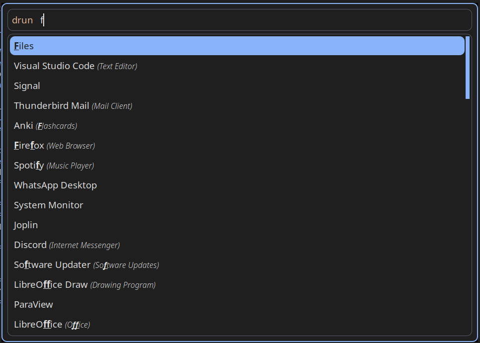

# Unified Theming For Ubuntu + i3 Configuration

This repository contains a unified theming setup for a Linux environment using the `i3` window manager. The base font and the all font and item colors (background, accent, syntax highlighting, ...) are setup unified.
It manages color palettes, configuration files, and helper scripts for the following tools:

- `i3` (window manager) + personalized keybindings, etc.
- `i3blocks` (status bar) + personalized design of the i3blocks status bar including location based weather information, battery status and switching of power modi, CPU information, volume control, wifi and bluetooth control
- `Yazi` (file manager)
- `VS Code`
- `Rofi`
- `Micro` (terminal editor)
- `Flameshot` (screenshot tool)
- `WezTerm` (terminal emulator)

The setup uses a `Makefile` to install everything in the correct places and keep all configs in sync.

Either all tools can be configured to be updated or just `i3`.

## Disclaimer

This is generally still a very personalized setup, e.g. with special keybindings in `i3` or the choice of the tools which I just intended for my personal use on Ubuntu. That's also why I cannot guarantee it working for you from the start, not messing with other settings you have, etc. However, still feel free to take inspiration from my setup :) I am also planning on separating the color costumization and the i3 configuration part into individual projects since that could perhaps be more useful for others than myself. But, for now, this repository just mainly holds my personal code.

Your local config for i3 is replaced by the scripts.

Please note: This setup is highly specific to my personal workflow on Ubuntu, including custom keybindings and tool selections. As such, I cannot guarantee compatibility with other systems or that it will not affect your existing configuration. Feel free to take inspiration from my approach and adapt elements to your own needs. In the future, I may separate the color customization and i3 configuration into distinct projects to make them more broadly useful. For now, this repository primarily contains my personal code and preferences tailored to my system.


---

## Examples

Example of the Micro terminal editor with Python syntax highlighting and unified colors:


Example of the i3 blocks status bar:


Example of the Rofi menu:


Example of the Color Palette Preview:


---

## Installation

1. Clone the repository:
   ```bash
   git clone <this-repo> ~/theming
   cd ~/theming
   ```

2. Install everything into the correct system locations:
   ```bash
   make install
   ```
   or for just the window manager configurations
   ```bash
   make install-i3 
   ```

   This will:
   - Symlink theming scripts into `~/.local/bin`
   - Install `font.json`, `palette.json`, and `syntax.json` into `~/.config/theme`
   - Link `i3` and `i3blocks` configs into `~/.config/i3` and `~/.config/i3blocks`
   It is done for either all needed files or just the ones needed for `i3`.
   Your local config for i3 will be replaced by the scripts.

3. Run the theming once:
   ```bash
   make retheme
   ```
   or for just the window manager configurations
   ```bash
   make retheme-i3
   ```

---

## Usage

- Update i3 config: Update `config.base` in this repository, run `make retheme-i3`

- Use different base i3 configuration: swap out the provided i3 base config: `~/theming/i3/i3_standard/config.base`

- Change color palette: adjust `palette.json`, `syntax.json`, and `font.json`, run `make retheme` or `make retheme-i3`

- Preview your palette  
  ```bash
  ~/.config/theme/visualize_colors
  ```

- Change color palette: adjust `palette.json`, `syntax.json`, and `font.json`

- Clean installed files  
  ```bash
  make clean
  ```

- Adjust single tools color parsing scripts: `./scripts/theme-<tool-name>` and then `make <tool-name>`

---

## Project Structure

```
.
├── Makefile                # Build/Install automation
├── i3/                     # i3 and i3blocks configs
│   ├── i3_standard/        # Base i3 config + helper scripts
│   │   ├── config.base
│   │   ├── keyboard.sh
│   │   ├── newnote.sh
│   │   ├── poweroff.sh
│   │   ├── touchpad.sh
│   │   └── volume.sh
│   └── i3_blocks/          # i3blocks config + helper scripts
│       ├── config
│       └── *.sh
├── scripts/                # Theming scripts for individual apps
│   ├── theme-yazi
│   ├── theme-vscode
│   ├── theme-rofi
│   ├── theme-i3-colors
│   ├── i3-build-config
│   ├── theme-micro
│   └── theme-flameshot
├── themes/                 # Palette + syntax definitions
│   ├── font.json
│   ├── palette.json
│   ├── syntax.json
│   ├── palette_preview.png
│   └── visualize_colors    # Script to preview palette colors
└── README.md               # This file
```
